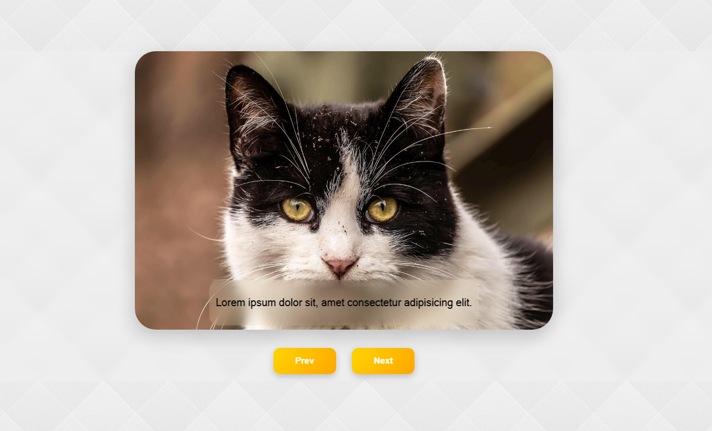
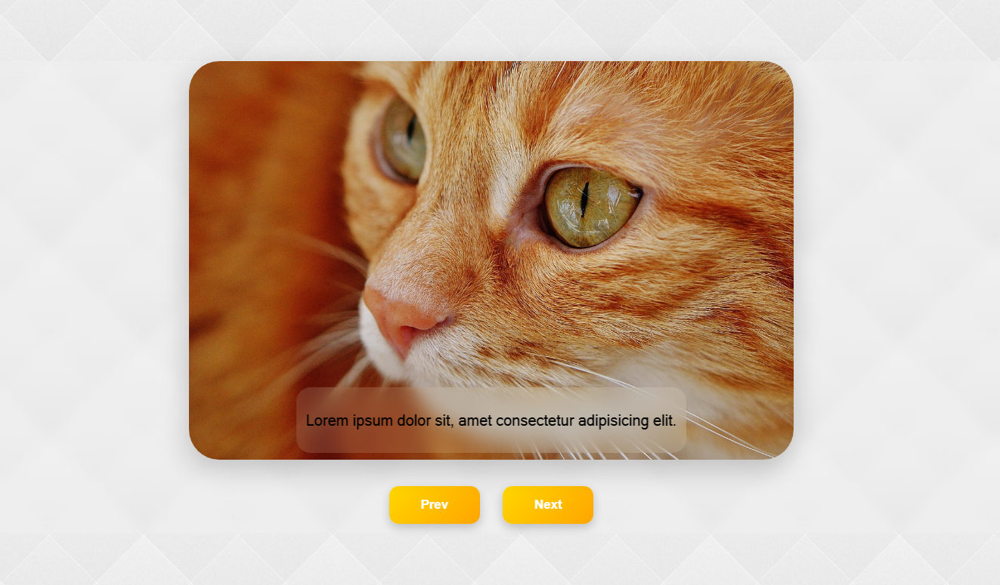

# Image Slider

Bu proje, HTML, CSS ve JavaScript kullanılarak oluşturulmuş basit bir resim kaydırıcıdır. Kullanıcıların "Önceki" ve "Sonraki" düğmelerini kullanarak bir dizi resim ve açıklamayı değiştirmesine olanak tanır.

## Özellikler

-   Karşılık gelen açıklamalarıyla birlikte bir dizi resim görüntüler.
-   Önceki veya sonraki resme gitmek için gezinme düğmeleri.
-   Farklı ekran boyutlarına uyum sağlayan duyarlı tasarım.
-   CSS stilleri ve animasyonlarla estetik açıdan hoş tasarım.

## Kullanılan Teknolojiler

-   HTML: Kaydırıcının içeriğini ve düzenini yapılandırmak için.
-   CSS: Kaydırıcıyı şekillendirmek ve görsel olarak çekici hale getirmek için.
-   JavaScript: Resim geçişlerini ve düğme tıklamalarını işlemek için.

## Proje Yapısı

Proje yapısı aşağıdaki gibidir:

-   `index.html`: Resim kaydırıcının yapısını içeren ana HTML dosyası.
-   `script.js`: Resim geçişlerini ve düğme tıklamalarını işleyen JavaScript dosyası.
-   `styles.css`: Resim kaydırıcısını şekillendiren CSS dosyası.
-   `img/`: Kaydırıcıda kullanılan resimleri içeren dizin.


## Katkıda Bulunanlar (Fotoğraflar)

- Resimler Pixabay'dan alınmıştır.

- Image by Rezső Terbe from Pixabay
- Image by Ana from Pixabay
- Image by Alexa from Pixabay
- Image by Oleksandr Dorohov from Pixabay
- Image by Manfred Richter from Pixabay
- Image by Gundula Vogel from Pixabay
- Image by katerinavulcova from Pixabay


## Kurulum

Bu projeyi yerel olarak çalıştırmak için, depoyu klonlayın ve `index.html` dosyasını tarayıcınızda açın.

```bash
git clone <depo-adresi>
cd resim-kaydirici
open index.html

```

## Görseller



